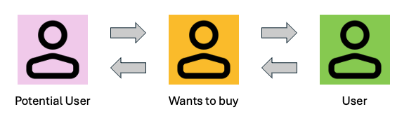
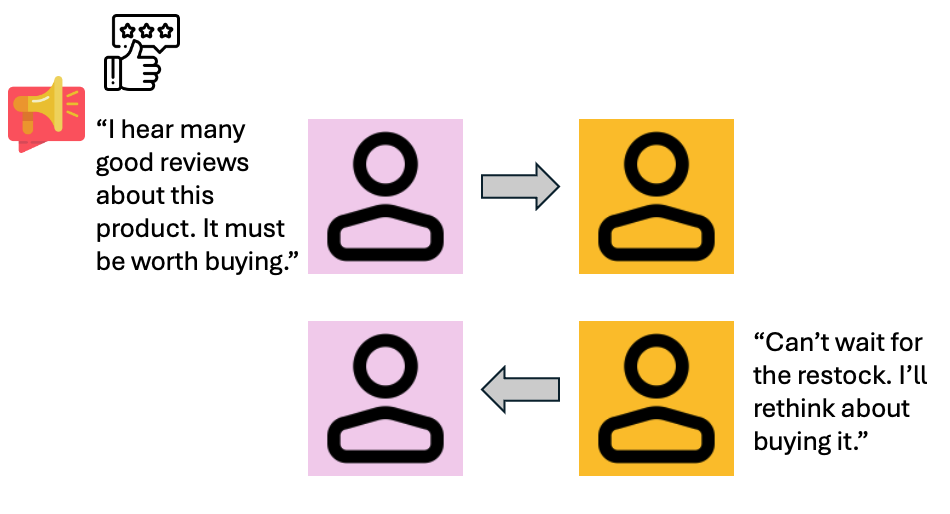
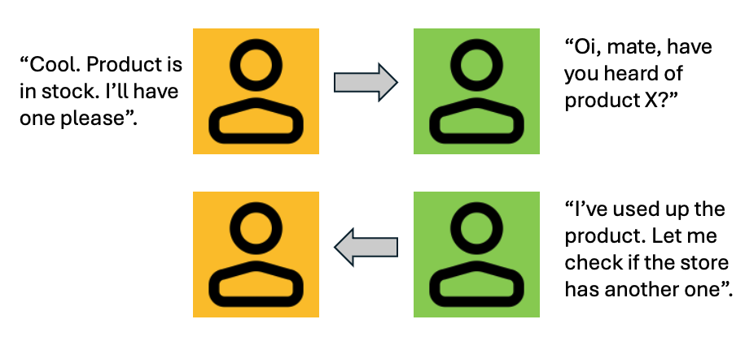
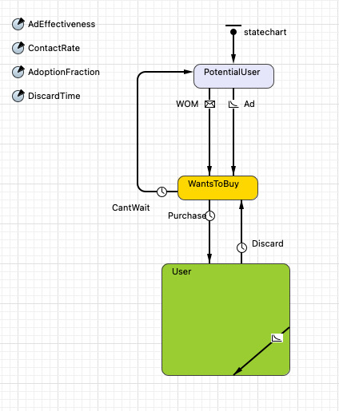
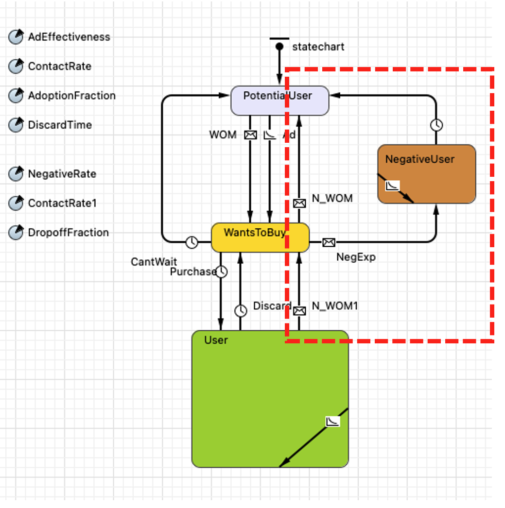
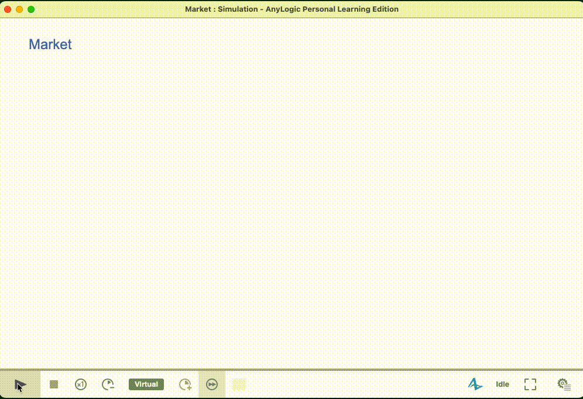
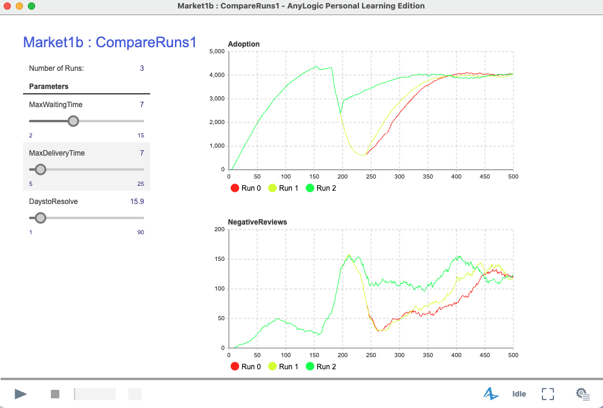
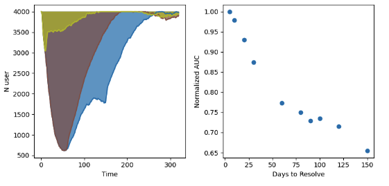

[Home](/) | [Research Blog](/blog)

---
### "Anylogic: Consumer Market Simulation"
*7 May 2025*

In these past few days, I've been exploring AnyLogic - a leading simulaton and modeling software for busness and industries. I followed their guide "AnyLogic in three-days" to build toy models for business application.

In this blog, I demonstrate an example Agent-Based consumer market model using Anylogic Software. Simulation provides a risk-free environment to find new solutions and understand dynamic systems. Building a toy model, I try to answer the following questions:

**Q1:** To what extend does business efficiency (customer waiting time/max delivery time) affect product adoption?;

**Q2:** What is the impact of a negative product review to product adoption?;

My goal is to share some insights to these questions based on the simulation model I built using AnyLogic software.

### Platform
All simulations were built and run using AnyLogic 8 Personal Learning Edition 8.9.8.

### A. Theoretical Foundations

**A.1 Agent-based model (ABM)** is a computational model approach that simulates actions and interactions of autonomous agents to understand the behavior of the system [https://en.wikipedia.org/wiki/Agent-based_model]. It uses a bottom-up approach of defining simple rules of agents in a micro-scale to uncover emergent macro-scale properties of the system.

**Statecharts**. In AnyLogic, the behavior of an agent is defined using a state chart. Statecharts are advanced constructs for describing event- and time-driven behavior [Anylogic book]. 

A statechart is comprised of states and a transition. A state (represented by a box) describes the characteristics/condition/behavior of an agent. Meanwhile, a transition (represented by arrows) connects one state to another state given certain rate/probability. 

**Statistics**.The power of ABM is its capability to re-create and predict the emergent behaviors and complex phenomena in a macro-scale [Wiki]. To capture these emergent behaviors, we can utilize aggregate statistical metrics such as counts (e.g., number of agents in a given state) across the simulation steps.

**Interactive App**. AnyLogic allows both modeling and interactive visualization of the model via java application. I think this is a neat feature to communicate the modeling exercise to both technical and non-technical audience.

**A.2 Consumer Market**
Lets build a toy model of a consumer market following the example in AnyLogic book. We first define the agent behavior, states and transitions. Consider a customer journey with the following States: (A) potential user, (B) wants to buy, and (C) user.

*Figure. The agents states that captures the customer journey from potential user to user.*

> *Insight.* We try to capture the behavior of each agents. I find it helpful to create visual scenarios to drill-in the behaviors and make the model development interesting.

A potential user (State A) is an agent who is someone who has no information yet about the product or is still deciding if he/she wants to buy the product. External factors such as review by word-of-mouth (WOM) and Advertisment (Ad) can help "transition" a potential user to someone who wants to buy (State B).

*Figure. The possible transitions to-from a potential user to someone who wants to buy.*

An agent in State B (Who wants to buy, Buyer) has decided to buy a product but need to wait for the product to arrive. This models a case wherein the agent wants to buy a product but the item is not available at the moment. The agent needs to wait for the store to restock the item. However, we consider the agent to be impatient and only allocates a fixed number of days to wait for the product to restock. Past these days, the agent could not wait longer and transitions back to a State A, potential user. If the product restocks within the agent's patience window, the agent purchases the product and transitions to a user.

*Figure. The transitions to-from someone who wants to buy and user. Also, a user can recommend the product through WOM to a potential user.*

Now as a user, the agent enjoys the product within a given product life. This could be a beauty product wherein it is consumed over a period of days once opened. In this state, the agent may also contact random agents in State A to recommend buying the product. After consuming the product in X days, the user then transitions back to State B of someone who wants to buy the product.

The figure below shows the overall statechart of the consumer market model and simulation. There are several rates (and parameters) in the model which are fixed:

* Ad Effectiveness (rate per day) - the rate that represents the effectivity of an advertising in leading a person to buy the product;
* Word-of-Mouth, WOM - is a trigger-based transition when a potential user transitions to a user after receiving a "BUY" recommendation/WOM. This transition occurs only with an Adoption Fraction probability;
* AdoptionFraction - the rate of adoption describing the transitions of potential user to someone who wants to buy;
* Discard time - describes the product lifetime.

For the simulation exercise, we have two dynamic parameters:

* CantWait - the number of days of that someone who wants to buy is willing to wait for restock (sampled from a triangular probability distribution); and
* Maximum Delivery time - the maximum delivery time of the product (also follows a triangular probability distribution).

*Figure. State chart and simulation output varying the Maximum Delivery time.*

| run | MaxWaiting | MaxDelivery | Ratio | Adoption |
|-----|-----------|------------|-------|----------|
| 0   | 7         | 5          | 0.71  | 95.1     |
| 1   | 7         | 7          | 1.00  | 95.1     |
| 2   | 7         | 10         | 1.43  | 86.0     |
| 3   | 7         | 14         | 2.00  | 72.4     |
| 4   | 7         | 18         | 2.57  | 59.2     |
| 5   | 7         | 21         | 3.00  | 48.8     |
| 6   | 7         | 25         | 3.57  | 44.8     |

*Table. Sample results of the simulation comparing various MaxDelivery with the Adoption rate*

In the simulation, we vary the Maximum Delivery Time and observe how the no. of Users (Adoption Rate) changes. Based on simulation, we can answer Q1. 

> *Insight*
> 
> **Q1:**, "To what extend does business efficiency (customer waiting time/max delivery time) affect product adoption?"
> 
> **A1:**. Business efficiency affects the adoption rate. When business is efficient meeting expectations/patience of consumer (MaxDeliveryTime ~ MaxWaiting), the adoption rate is at 95%. As MaxDeliveryTime lengthens (due to delays or disruptions), the adoption rate falls to 49% when (MaxDelivery/MaxWaiting = 3x). Thus, its is important for business to capture and match the consumers willingness to wait the restocking rate to maximum product sales.

### B. Application
I now extend our base model to incorporate the effect of negative reviews with Adoption. I introduced a new block that captures behavior of a user with negative experience.

> *Insight*. In building this models, I find that skills and creativity should go together. I need creativity to create an abstraction how the agents would work. I also need skills to translate my ideas and implement it to AnyLogic platform. It was a back-and-forth process of trying to debug and understand how different functions and parameters are setup.

WantsToBuy --> Negative User. This transition is random a 1% probability with the idea that in every 100 buyers, there is a chance 1 buyer who will have a negative review (referred to as NegativeUser).

Now this Negative User will randomly send "DontBuy" message to User and Buyers. For user, receiving a DontBuy message will discourage product use (50% probability of transition USER->BUYER). For buyer, receiving a DontBuy message will encourage a change of decision (90% probability of transition BUYER->PotentialUser).

The corresponding state chart with the negative User is shown below.

To understand the effect of negative reviews. I simulate an adversarial attack event on the system at t=180 days. At this point, I increased the Negative contact rate, the number of "DontBuy" messages sent to random agent from 2 to 7 per day. I also included a parameter DaystoResolve which captures the number of days until the attack is removed, 180 + N_daystoresolve.

From the simulation from t<180 days, the product adoption increases up to 4,000 users. At t=180 days, we can observe a large drop in USERS due to the adversarial attack. After after 280 days (180 + N_daystoresolve), we can observe that the adoption reverts back to initial level close to 4,000.

We can test this for different N_daystoresolve, 100 days (red), 60 days, 15 days (green) using compare runs in AnyLogic. We can the resulting adoption curve for varied days to resolve. Notably, we can see similar fraction of Negative Users across simulation runs.

I utilized python to further examine the curve, such as taking the area-under-the-curve (AUC). The AUC corresponds to the loss cumulative user engagement with units (N users * time). I normalized the AUC relative to the control case (AUC for DaystoResolve=1). This AUC could be used to estimate the loss in profit when users disengages with the product. 

> From the simulation, we can provide some insights for 
> 
> **Q2:** What is the impact of a negative product review?;
> 
> **A2:** A negative product review significantly impacts the adoption and cumulative user engagement particularly with the presence of highly active Negative Users (high contact rate). A 60 day resolution from the negative review attack results to 75% loss in user-engagement. Thus, this exercise provides test scenarios on the resilience of the system and highlights possible interventions to mitigate attacks

### Final thoughts
This blog demonstrates an agent-based model (ABM) of consumer market built in AnyLogic. From the simulation, I find that matching consumer wait time with the delivery time (business efficiency) affect product adoption. Extending the model the incorporate negative reviews/attacks, I find that highly active negative users decreased product adoption with the AUC as a potential metric to estimate the loss in user engagement and business profit. Overall, this highlights the usefulness of simulation models such as ABM to test scenarios and derive insights that support business profitabilty and operational resilience.

Codes used to generate the figures may be found here: [View Code Repository on GitHub]()

Disclaimer of AI use: Claude Haiku was used to improve the flow of the discussion.

### Reference:
https://en.wikipedia.org/wiki/Agent-based_model

Grigoryev, I. 2025. "Anylogic 8 in three days: A quick course in simulation modeling". 6th Edition. The Anylogic Company: Chicago, IL, USA.

